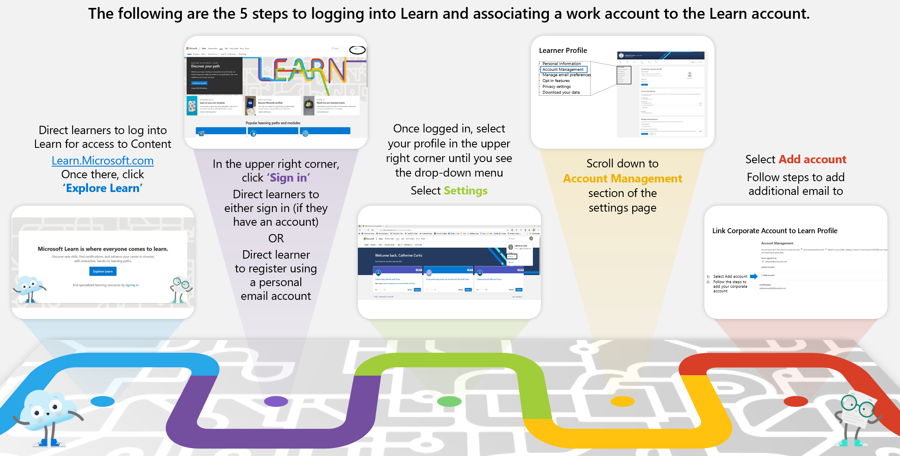
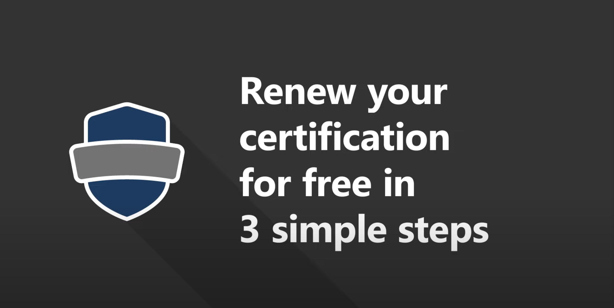

---
# You don't need to edit this file, it's empty on purpose.
# Edit theme's home layout instead if you wanna make some changes
# See: https://jekyllrb.com/docs/themes/#overriding-theme-defaults
layout: single
author_profile: true
header:
  overlay_image: /assets/images/header.png
  overlay_filter: 0.2 # same as adding an opacity of 0.2 to a black background
sidebar:
  nav: "exams"
---
## Microsoft Learn
:earth_americas:[Microsoft Learn](https://www.Microsoft.com/Learn "Microsoft Learn")

:warning: Associate work/personal accounts

## General Resources

:earth_americas: [Microsoft Certification Overview ](https://www.microsoft.com/certification "Microsoft Certification Overview ")

:earth_americas: [Microsoft Official Curriculum ](https://www.aka.ms/MOC "Microsoft Official Curriculum ")

:earth_americas:[Microsoft Learn](https://www.Microsoft.com/Learn "Microsoft Learn")

:earth_americas: [Azure Architecture Center](https://www.aka.ms/architecture "Azure Architecture Center")

:earth_americas: [Certification Poster](https://www.aka.ms/TrainCertPoster "Certification Poster")

:earth_americas: [Microsoft Docs](https://www.aka.ms/Docs "Microsoft Docs")

## Microsoft ESI program resources
:earth_americas: Learner experience portal: [ESI customer portal](https://esi.microsoft.com/)

  > :free: FREE Practise Exams:
  

:sos: Need to ask question about the program? Open a Ticket? [ESI support](https://esisupport.microsoft.com/)

## Course Provided Material
:computer: [Hosted Lab VM website](https://esi.learnondemand.net/)
  > :warning:: activated for 6 Months 

:chart_with_upwards_trend: [Azure Pass Susbcriptions Balance](https://www.microsoftazuresponsorships.com/balance)
  > :warning:: Valid for 1 month and/or 100$

## Exam Preparation & Renewal Material
:arrow_forward: How to register for the exams:

  > :warning:: How many vouchers do I have? It depends on the customer´s ESI program, ask internally.

:earth_americas: Exam retake policy : [Retake policy](https://docs.microsoft.com/en-us/learn/certifications/exam-retake-policy#general-microsoft-certification-exam-retake-policy)

:earth_americas: Study Guides for all exams: [ESI Study Guides](https://aka.ms/ESIStudyGuides) 

:earth_americas: Learning Path for all exams:  [Learning Path recommendation](https://aka.ms/AzureTrainCertDeck)

:interrobang: What is the duration of the exam? What kind of questions can I get? [Microsoft Exam Question Types](https://docs.microsoft.com/en-us/learn/certifications/exam-duration-question-types#question-types-on-exams)

:computer: How does the exam enviroment/tool look like? [Microsoft Exam Environment Demo](http://aka.ms/examdemo)

:earth_americas: [Renew your Microsoft Certification](https://docs.microsoft.com/en-us/learn/certifications/renew-your-microsoft-certification)

:arrow_forward: [Renewal Process video](https://www.youtube.com/watch?v=ttuhmFHOTU8&feature=youtu.be)

:earth_americas: [Take the exam at home](https://www.thomasmaurer.ch/2020/03/how-to-take-a-microsoft-certification-exam-online/)
