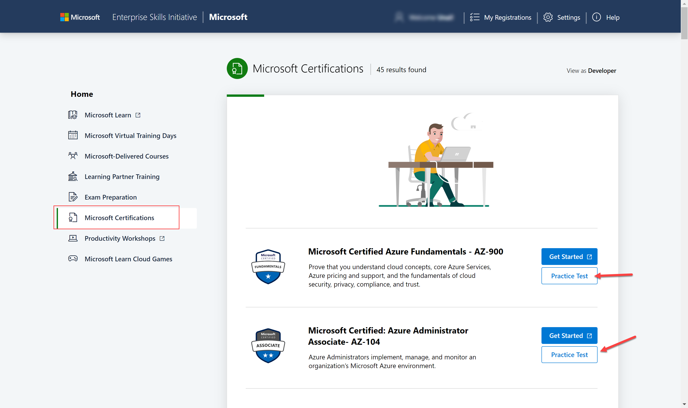

---
# You don't need to edit this file, it's empty on purpose.
# Edit theme's home layout instead if you wanna make some changes
# See: https://jekyllrb.com/docs/themes/#overriding-theme-defaults
layout: single
author_profile: true
header:
  title: hello
  overlay_image: /assets/images/header2.png
  overlay_filter: 0.2 # same as adding an opacity of 0.2 to a black background
sidebar:
  nav: "exams"
---
# Microsoft Trainer Team Guidance to ESI Resources

This website is a collection of exam related links/material maintained by Microsoft Technical Trainers. As a learner, you will find information you may need to get prepared for a Microsoft Certification exam.

On the **General Resources** tab you will find the following information: 

- [Microsoft Learn](#microsoft-learn)
- [Microsoft Enterprise Skilling Initiative (ESI) program resources](#microsoft-enterprise-skilling-initiative-esi-program-resources)
- [Lab Environment (Skillable)](#lab-environment-skillable)
- [Course Provided Azure Subscription (2 options)](#course-provided-azure-subscription-2-options)
- [Exam Preparation & Renewal Material](#exam-preparation--renewal-material)
- [General Resources](#general-resources)

On the individual **Exam** pages you will find:
- Reference to Microsoft Learn material for the course/exam
- Lab instructions for the course/exam

## Microsoft Learn
:earth_americas:[Microsoft Learn](https://learn.microsoft.com/ "Microsoft Learn")

:warning: Associate work/personal accounts

## Microsoft Enterprise Skilling Initiative (ESI) program resources

:earth_americas: Learner Experience Portal (LxP): [ESI customer portal](https://esi.microsoft.com/)

  > :free: FREE Practice Exams:
  

:sos: Need to ask questions about the program? Open a ticket? [ESI support](https://esisupport.microsoft.com/)

## Lab Environment (Skillable)
:computer: [Skillable Hosted Lab VM website](https://esi.learnondemand.net/)
  > :warning:: Activated for 6 months 

## Course Provided Azure Subscription (2 options)

:warning: **Your course will be using one of the following options.** If you are given a predefined Azure account on the lab instruccions, Cloudslice will be your subscription type.

1. :chart_with_upwards_trend: **Azure Cloud Slice by Skillable** : ready-to-use azure environment/account prepared for you
    > :warning: **Limitations**

    - Launch lab only up to 10 times 

    - Each launch has a time limit that must be used within that time (no save) 

    - You can extend the lab for 40 minutes for the first time and then 20 minutes the second time. Getting an additional 60 minutes added to your lab time (this may vary depending on the course) 

    - Labs will be available for 6 months when learner redeems training key 

    - Skillable creates each lab with policies that prevent the learner from creating anything that is not part of the lab objectives

1. :chart_with_upwards_trend: **Microsoft Azure Pass** 
    - [Balance](https://www.microsoftazuresponsorships.com/balance)
    - [Activate Azure Pass in 5 steps](https://aka.ms/activatepass)
    > :warning: Valid for 1 month and/or 50-150$ (amount depends on course)

1. :earth_americas: [Comparison table](https://www.skillable.com/moc-cloud-slice/) 

## Exam Preparation & Renewal Material

:mag: Videos with tips, tricks, and strategies for preparing for a Microsoft Certification exam: [Exam Readiness Zone](https://learn.microsoft.com/en-us/shows/exam-readiness-zone/)

:arrow_forward: How to register for exams:

  > :warning:: How many vouchers do I have? It depends on the customer´s ESI program, ask internally.

:earth_americas: Exam retake policy : [Retake policy](https://learn.microsoft.com/en-us/certifications/exam-retake-policy#general-microsoft-certification-exam-retake-policy)

:earth_americas: Available courses, skilling maps and cloud adoption guidance [Azure Training Journey](https://aka.ms/esiAzureTrainingJourney) 

:earth_americas: Learning Path for all exams:  [Learning Path recommendation](https://aka.ms/AzureTrainCertDeck)

:interrobang: What is the duration of the exam? What kind of questions can I get? [Microsoft Exam Question Types](https://docs.microsoft.com/en-us/learn/certifications/exam-duration-question-types#question-types-on-exams)

:computer: How does the exam enviroment/tool look like? [Microsoft Exam Environment Demo](http://aka.ms/examdemo)

:earth_americas: [Renew your Microsoft Certification](https://learn.microsoft.com/en-us/certifications/renew-your-microsoft-certification)

:arrow_forward: [Renewal Process video](https://www.youtube.com/watch?v=ttuhmFHOTU8&feature=youtu.be)

:earth_americas: [Take the exam at home](https://www.thomasmaurer.ch/2020/03/how-to-take-a-microsoft-certification-exam-online/)

:star: [Celebrate your Microsoft Skills](https://aka.ms/CelebrateYourMicrosoftSkills)

## General Resources

:earth_americas: [Microsoft Certification Overview ](https://www.microsoft.com/certification "Microsoft Certification Overview ")

:earth_americas: [Microsoft Official Curriculum ](https://www.aka.ms/MOC "Microsoft Official Curriculum ")

:earth_americas: [Azure Architecture Center](https://www.aka.ms/architecture "Azure Architecture Center")

:earth_americas: [Certification Poster](https://www.aka.ms/TrainCertPoster "Certification Poster")

:earth_americas: [Azure Fridays](https://learn.microsoft.com/en-us/shows/azure-friday/)

:earth_americas: [Channel 9](https://channel9.msdn.com/)

:earth_americas: [Azure blog](https://azure.microsoft.com/en-us/blog/)

:earth_americas: [Azure forums](https://social.msdn.microsoft.com/Forums/enUS/home?category=windowsazureplatform)

:earth_americas: [Azure Pricing Calculator](https://azure.microsoft.com/en-in/pricing/calculator/)

:earth_americas: [Total Cost of Ownership (TCO) Calculator](https://azure.microsoft.com/en-us/pricing/tco/calculator/)

:earth_americas: [Free Azure E-books](https://azure.microsoft.com/en-us/resources/whitepapers/)
